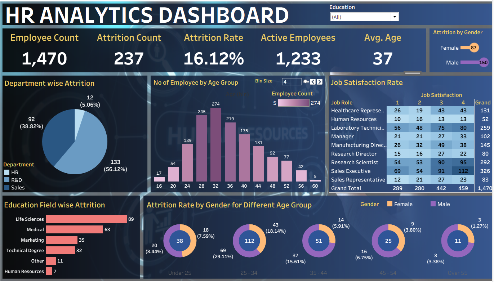

# 📊 HR Analytics Dashboard

An interactive **Tableau dashboard** created to analyze employee attrition across departments, age groups, education fields, job roles, and gender for a workforce of **1,470 employees**.

---

## 📌 Project Overview

The **HR Analytics Dashboard** provides a complete overview of workforce attrition and satisfaction.

It helps identify:

- The departments with the highest attrition
- The age groups most likely to leave
- How job satisfaction varies by role
- Which education fields see the most attrition
- Gender-based attrition patterns across age groups
- Overall headcount, attrition rate, and active employees

The dashboard contains an interactive **Education** filter that lets users drill into attrition patterns for a specific field of study.

---

## 🖼️ Dashboard Preview



---

## 🎯 Project Objectives

The main objectives of this project are:

- Track overall workforce attrition
- Compare attrition across departments
- Identify age groups with the highest attrition risk
- Analyze job satisfaction by job role
- Understand attrition by education field
- Break down attrition by gender within each age band
- Provide interactive filtering for detailed HR analysis
- Support data-driven retention decisions

---

## 📈 Key Performance Indicators

| KPI | Value |
|---|---:|
| Employee Count | 1,470 |
| Attrition Count | 237 |
| Attrition Rate | 16.12% |
| Active Employees | 1,233 |
| Average Age | 37 |

---

## 📊 Dashboard Analysis

### 1. Attrition by Gender

| Gender | Attrition Count |
|---|---:|
| Male | 150 |
| Female | 87 |

**Insight:** Male employees account for nearly two-thirds of total attrition.

---

### 2. Department-wise Attrition

| Department | Attrition Count | Share |
|---|---:|---:|
| Sales | 133 | 56.12% |
| R&D | 92 | 38.82% |
| HR | 12 | 5.06% |

**Insight:** Sales and R&D together account for nearly 95% of all attrition, while HR contributes the least.

---

### 3. Employee Count by Age Group

The age distribution histogram (bin size adjustable) shows headcount concentrated in the 28–36 age range, with the **32–36 band** being the largest single group at 274 employees.

This chart helps identify:

- Where the bulk of the workforce sits by age
- Which age bands are shrinking or growing
- Generational representation across the company

---

### 4. Job Satisfaction Rate by Job Role

| Job Role | Total Employees | Grand Total Satisfaction Score |
|---|---:|---:|
| Sales Executive | 326 | 326 |
| Research Scientist | 292 | 292 |
| Laboratory Technician | 259 | 259 |
| Manufacturing Director | 145 | 145 |
| Healthcare Representative | 131 | 131 |
| Manager | 102 | 102 |
| Sales Representative | 83 | 83 |
| Research Director | 80 | 80 |
| Human Resources | 52 | 52 |

**Insight:** Sales Executives and Research Scientists are the two largest job roles, and both show a healthy skew toward satisfaction levels 3 and 4.

---

### 5. Education Field-wise Attrition

| Education Field | Attrition Count |
|---|---:|
| Life Sciences | 89 |
| Medical | 63 |
| Marketing | 35 |
| Technical Degree | 32 |
| Other | 11 |
| Human Resources | 7 |

**Insight:** Life Sciences and Medical backgrounds account for the majority of attrition, consistent with their larger representation in R&D and Healthcare roles.

---

### 6. Attrition Rate by Gender for Different Age Groups

| Age Group | Total Attrition | Attrition Rate |
|---|---:|---:|
| Under 25 | 38 | 8.44% |
| 25–34 | 112 | 18.14% |
| 35–44 | 51 | 15.61% |
| 45–54 | 25 | 3.80% |
| Over 55 | 11 | 1.27% |

**Insight:** The 25–34 age group has both the highest attrition count (112) and the highest attrition rate (18.14%), making early-career employees the primary retention focus. Attrition rate declines steadily with age from there.

---

## 🔍 Dashboard Filters

The dashboard includes the following interactive filter:

- Education Field

This filter allows users to explore attrition, satisfaction, and demographic breakdowns for a specific education background.

---

## 💡 Key Insights

- Attrition rate stands at **16.12%**, with 237 employees having left out of 1,470.
- **Sales (56.12%)** and **R&D (38.82%)** together drive almost all attrition; **HR** attrition is minimal at 5.06%.
- The **25–34 age group** is the highest-risk segment, with an **18.14% attrition rate** and 112 total departures.
- Attrition rate **falls consistently with age**, from 8.44% (Under 25) down to 1.27% (Over 55).
- **Male employees** account for 150 of 237 total attritions, compared to 87 for female employees.
- **Life Sciences (89)** and **Medical (63)** education fields see the most attrition, in line with their heavy representation in R&D and Healthcare roles.
- Employees who **work overtime** leave at nearly **3x the rate** of those who don't (30.53% vs. 10.44%), based on the underlying dataset.
- **Single employees** have the highest attrition rate among marital statuses (25.53%), compared to Married (12.48%) and Divorced (10.09%).
- Employees who **travel frequently** for business attrit at a higher rate (24.91%) than those who rarely travel (14.96%) or don't travel at all (8.00%).
- Employees who leave have, on average, a **lower monthly income** (~$4,787) and **fewer years at the company** (~5.1 years) than those who stay (~$6,833 and ~7.4 years respectively).

---

## 🛠️ Tools and Technologies Used

- Tableau Desktop / Tableau Public
- Microsoft Excel / CSV Dataset
- Data Cleaning
- Data Transformation
- Calculated Fields
- Data Visualization
- Business Intelligence

---

## ⚙️ Project Workflow

1. Collected the HR employee attrition dataset.
2. Imported the dataset into Tableau.
3. Reviewed the dataset structure and field types.
4. Checked for missing values and duplicate records.
5. Corrected field names and data types (e.g., Age, Department, Education Field).
6. Cleaned and transformed the data for analysis.
7. Created age bins for the "No of Employees by Age Group" histogram.
8. Created calculated fields for attrition rate and satisfaction breakdowns.
9. Designed KPI cards for headcount, attrition, and average age.
10. Created the department-wise attrition pie chart.
11. Created the employee count by age group histogram.
12. Built the job satisfaction cross-tab by job role.
13. Created the education field-wise attrition bar chart.
14. Built the gender-by-age-group attrition donut charts.
15. Added the Education Field interactive filter.
16. Applied formatting, color coding, and dashboard layout improvements.
17. Tested dashboard interactivity and filter behavior.
18. Extracted key business insights.

---

## 📐 Calculated Fields

Some of the key calculated fields used in the dashboard:

```
Attrition Count =
COUNTIF([Attrition] = "Yes")
```

```
Employee Count =
COUNTD([Employee Number])
```

```
Active Employees =
[Employee Count] - [Attrition Count]
```

```
Attrition Rate =
[Attrition Count] / [Employee Count]
```

```
Average Age =
AVG([Age])
```

> Field names may need to be adjusted according to the names used in the Tableau workbook.

---

## 📂 Repository Structure

```text
HR-Analytics-Tableau-Dashboard/
│
├── README.md
├── LICENSE
├── Dashboard_Preview.png
├── HR Analytics Tableau Dashboard.twb
└── HR Data.xlsx - HR data.csv
```

---

## 🚀 How to Use This Project

1. Download or clone this repository.
2. Install Tableau Desktop (or use Tableau Public).
3. Open `HR Analytics Tableau Dashboard.twb`.
4. If prompted for a missing data source, point it to `HR Data.xlsx - HR data.csv`.
5. Refresh the data source.
6. Use the Education filter to explore the report.
7. Select different education fields for detailed attrition analysis.

> 💡 Tip: To share a fully self-contained file with no broken data links, open the workbook in Tableau Desktop and use **File → Export Packaged Workbook** to save a `.twbx` version.

---

## 💼 Business Value

This dashboard can help HR managers, People Analytics teams, and business leaders to:

- Understand where and why attrition is happening
- Identify high-risk employee segments by age, department, and role
- Prioritize retention efforts for early-career employees
- Monitor job satisfaction trends by role
- Compare attrition across education backgrounds
- Support data-driven hiring and retention strategy
- Reduce the cost of unplanned turnover

---

## 📚 Skills Demonstrated

- Data Cleaning
- Data Transformation
- Calculated Fields
- KPI Development
- Dashboard Designing
- Data Visualization
- Attrition Analysis
- Demographic Analysis
- Business Insight Generation
- Interactive Reporting
- Tableau Development

---

## 🔮 Future Improvements

The dashboard can be improved further by adding:

- Predictive attrition modeling
- Salary band vs. attrition analysis
- Overtime vs. attrition breakdown
- Manager-level attrition analysis
- Tenure-based cohort analysis
- Performance rating vs. attrition
- Work-life balance impact analysis
- Exit reason categorization
- Cost-of-attrition estimation
- Year-over-year attrition trend

---

## 👤 Author

**Aftab Monye**

Aspiring Data Analyst

### Technical Skills

Excel | SQL | Tableau | Power BI | Python

### LinkedIn

[Connect with me on LinkedIn](https://www.linkedin.com/in/aftab-monye/)

---

## 📄 License

This project is licensed under the terms of the [LICENSE](LICENSE) file included in this repository.

---

## 🤝 Feedback

Feedback and suggestions are welcome.

Feel free to explore the project and share your thoughts.

---

## ⭐ Support

If you found this project helpful, consider giving the repository a star.
